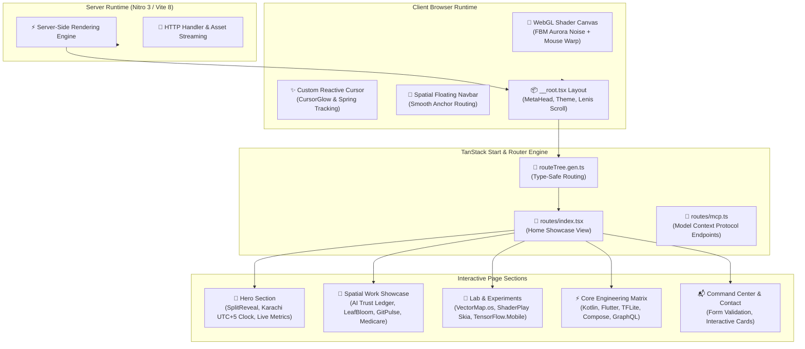

# 🌌 Muhammad Shayan — Engineering Portfolio

[](https://github.com/shayann07/Personal-Porfolio-Website)
[](https://tanstack.com/start)
[](https://react.dev/)
[](https://tailwindcss.com/)
[](https://vitejs.dev/)
[](https://nitro.unjs.io/)
[](LICENSE)

> A cutting-edge, high-performance personal portfolio engineered with **TanStack Start SSR**, **React 19**, **Tailwind CSS v4**, **Custom WebGL GLSL Shaders**, and **Framer Motion** spatial micro-interactions.

---

## 📖 Overview

**Personal-Porfolio-Website** represents the state-of-the-art in modern frontend engineering and creative developer presentation. Designed as a showcase of mobile systems engineering (Android, Flutter, On-Device ML, and Distributed Tooling), the website delivers a spatial user experience that merges strict type safety and server-side rendering with fluid GPU-accelerated motion graphics.

### Visual & Architectural Philosophy
- **Spatial Dimension**: Interactive 3D cards and layered surfaces responsive to cursor vector velocity and pointer physics.
- **Atmospheric Visuals**: A custom WebGL fragment shader canvas rendering a real-time reactive violet aurora noise field with interactive mouse repulsion warps and chromatic falloff.
- **Server-First Modernity**: Powered by TanStack Start on top of Vite 8 and Nitro 3, delivering instantaneous sub-second cold loads, full meta-tag Open Graph SSR hydration, and seamless client-side page transitions.
- **Kinetic Typography & Motion**: Character-by-character split reveal choreography and spring-based scroll tracking with accessibility fallbacks (`prefers-reduced-motion`).

---

## 🏗️ Architecture & Component Hierarchy



---

## ✨ Visual Features & Interactive Capabilities

- **Fluid WebGL Aurora Shader**: Custom GLSL shader with 5-octave Fractal Brownian Motion (FBM), real-time mouse distance warp distortion, and custom cosmic color palettes (`#0b0a0e` deep cosmic shadow, plum slate, crimson ember, and cotton bloom).
- **Spatial 3D Depth Cards**: Physics-driven hover orientation, multi-axis spring tilts, and particle backdrops built with `@react-three/fiber` and Framer Motion.
- **Split-Word Character Reveal**: Kinetic typography rendering words into individual masked character spans with staggered easing cubic-beziers (`[0.7, 0, 0.2, 1]`).
- **Live Karachi Real-Time Clock**: Dynamic timezone-aware ticker (`Asia/Karachi` UTC+5) updated via automated interval workers.
- **Lenis Kinetic Smooth Scroll**: Inertia-managed vertical scrolling orchestrated with custom easing curves and native touch multipliers.
- **Radix UI Accessible Primitives**: Built-in tooltips, dialogs, accordions, context menus, and sheets styled with Tailwind CSS v4 CSS variables.
- **Model Context Protocol (MCP) Integration**: Built-in endpoints leveraging `@lovable.dev/mcp-js` for AI-agent interoperability and contextual tooling.

---

## 📱 Key Modules & Component Architecture

| Module / Component | File Location | Purpose & Capabilities |
|---|---|---|
| **WebGL Shader Canvas** | [`src/components/ShaderBackground.tsx`](file:///d:/Work/github_full_account/Personal-Porfolio-Website/src/components/ShaderBackground.tsx) | GPU-accelerated background rendering procedural noise & pointer warp |
| **Spatial Work Deck** | [`src/components/SpatialWork.tsx`](file:///d:/Work/github_full_account/Personal-Porfolio-Website/src/components/SpatialWork.tsx) | Interactive portfolio card gallery with project tags and year chips |
| **Spatial Stack** | [`src/components/SpatialStack.tsx`](file:///d:/Work/github_full_account/Personal-Porfolio-Website/src/components/SpatialStack.tsx) | Layered spatial cluster components reacting to 3D pointer vectors |
| **Spatial Navigation** | [`src/components/SpatialNav.tsx`](file:///d:/Work/github_full_account/Personal-Porfolio-Website/src/components/SpatialNav.tsx) | Floating pill navigation bar with active section indicator |
| **Cursor Glow Effect** | [`src/components/CursorGlow.tsx`](file:///d:/Work/github_full_account/Personal-Porfolio-Website/src/components/CursorGlow.tsx) | High-performance mouse glow halo tracking screen pointer coordinates |
| **Animated Icons** | [`src/components/AnimatedIcon.tsx`](file:///d:/Work/github_full_account/Personal-Porfolio-Website/src/components/AnimatedIcon.tsx) | SVG Lucide icons enhanced with micro-interaction state spring animations |
| **Home Route View** | [`src/routes/index.tsx`](file:///d:/Work/github_full_account/Personal-Porfolio-Website/src/routes/index.tsx) | Central portfolio page aggregating metrics, projects, lab items, and bio |
| **Root Shell** | [`src/routes/__root.tsx`](file:///d:/Work/github_full_account/Personal-Porfolio-Website/src/routes/__root.tsx) | Root HTML shell, SSR document head tags, theme provider, and global style injection |

---

## 🛠️ Technical Stack Matrix

| Domain | Technology | Version | Description / Purpose |
|---|---|---|---|
| **Core Framework** | React | `^19.2.0` | Next-generation React engine with automatic batching & transitions |
| **SSR & Meta Framework** | TanStack Start | `^1.168.26` | Full-stack React framework with SSR and streaming hydration |
| **Routing** | TanStack React Router | `^1.170.16` | 100% type-safe routing with search param validation and route trees |
| **Build Tooling** | Vite | `^8.0.16` | Blazing fast ESM dev server and rollup production bundler |
| **Server Engine** | Nitro | `3.0.260603-beta`| Universal server engine deploying anywhere (Vercel, Netlify, Node) |
| **CSS & Styling** | Tailwind CSS v4 | `^4.2.1` | Modern engine with `@tailwindcss/vite` plugin and `@theme` directives |
| **Animation Engine** | Framer Motion | `^12.42.2` | Complex spring physics, layout animations, and gesture tracking |
| **3D & Canvas** | Three.js & R3F | `^0.185.1` / `^9.6.1` | WebGL canvas integration, shader compilation, and 3D rendering |
| **Smooth Scroll** | Lenis | `^1.3.25` | Smooth momentum scrolling engine with custom easing curves |
| **UI Primitives** | Radix UI | Latest | Unstyled, accessible component primitives |
| **Icons & Visuals** | Lucide React | `^1.26.0` | Comprehensive feather-style vector icon library |
| **Testing** | Vitest | `^4.1.10` | Vite-native unit and integration test runner |

---

## 🚀 Getting Started

### Prerequisites
- **Node.js**: `v20.x` or higher (or **Bun** `v1.1+`)
- **Package Manager**: `npm`, `pnpm`, or `bun`

### Installation & Local Development

1. **Clone the Repository**:
   ```bash
   git clone https://github.com/shayann07/Personal-Porfolio-Website.git
   cd Personal-Porfolio-Website
   ```

2. **Install Dependencies**:
   ```bash
   # Using Bun (Recommended)
   bun install

   # Or using npm
   npm install
   ```

3. **Configure Environment Variables**:
   Create a `.env` file based on `.env.example` if required:
   ```bash
   cp .env.example .env
   ```

4. **Launch Development Server**:
   ```bash
   bun dev
   # Or: npm run dev
   ```
   The site will be available at `http://localhost:3000` (or the port specified by Vite).

5. **Build for Production**:
   ```bash
   bun run build
   # Or: npm run build
   ```

6. **Preview Production Build**:
   ```bash
   bun run preview
   # Or: npm run preview
   ```

---

## 🧪 Testing & Code Quality

```bash
# Run unit & component test suite
npm test

# Run visual icon regression tests
npm run test:visual

# Lint codebase
npm run lint

# Format code with Prettier
npm run format
```

---

## 📄 License

This project is licensed under the [MIT License](LICENSE) — Copyright (c) 2026 [shayann07](https://github.com/shayann07).
